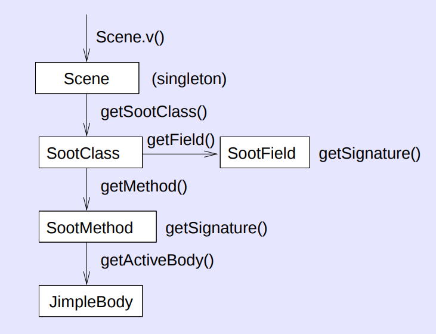

 

## 不同类的区分

- argument classes: 特定于Soot的类，使用`-process-dir`指明
- application classes: 用于分析和转换的Java类（相当于Soot框架的输入）
- library classes: 应用类中所引用的外部库，不会被分析

## 两种模式

- application mode
- non-application mode

区别在于有无主程序入口

## Options参数设置

set_prepend_classpath：引入必须的Java类

set_allow_phantom_refs：允许外部的引用（未引入soot的引用）

set_soot_classpath：设置待分析的Java类文件的目录

set_process_dir：设置argument classes的目录

```java
// 常用设置
Options.v().set_prepend_classpath(true);
Options.v().set_allow_phantom_refs(true);
Options.v().set_soot_classpath(sourceDirectory);
Options.v().set_output_format(Options.output_format_jimple);
Options.v().set_process_dir(Collections.singletonList(sourceDirectory));
Options.v().set_whole_program(true);
Options.v().set_keep_line_number(true);
Scene.v().loadNecessaryClasses();
```

## SootClass结构



## 常见错误

### `Exception in thread "main" java.lang.Error: Error: Failed to load java.lang.CharSequence.`

不能使用Java 8解析Java文件，因为字符串等内部类做了改动，可以改为Java 7

或者使用编译好的字节码文件

**【重要】解决方法**

[fix bug in analyzing source code, fixes](https://github.com/soot-oss/soot/pull/1384)

使用`develop`分支：

```xml
<dependencies>
  <dependency>
    <groupId>org.soot-oss</groupId>
    <artifactId>soot</artifactId>
    <version>4.3.0-SNAPSHOT</version>
  </dependency>
</dependencies>
<repositories>
  <repository>
      <id>sonatype-snapshots</id>
      <url>https://oss.sonatype.org/content/repositories/snapshots</url>
      <releases>
          <enabled>false</enabled>
      </releases>
  </repository>
</repositories>	
```

如果找不到仓库，检查`settings.xml`中的配置，参见[CSDN - pom.xml中引入repository无效](https://blog.csdn.net/qq_32094503/article/details/100557689)


### `Exception in thread "main" soot.SootResolver$SootClassNotFoundException: couldn't find class:...`

检查Options参数设置

### `SootMethod.getActiveBody()`得不到结果

使用`retrieveActiveBody`方法手动生成

## 参考资料

https://github.com/Sable/soot/raw/develop/doc/PLDI03_Tutorial.pdf

http://www.brics.dk/SootGuide/

